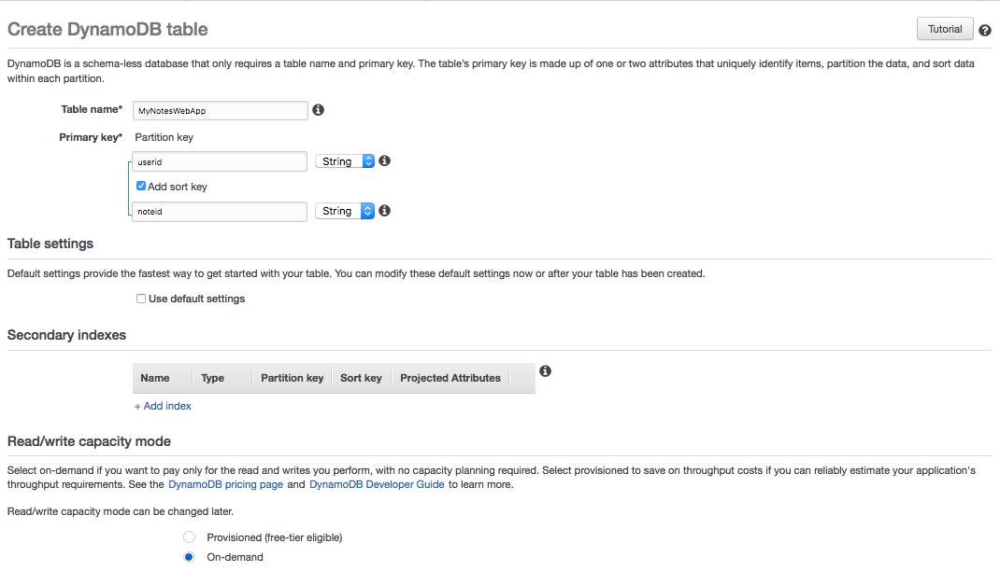
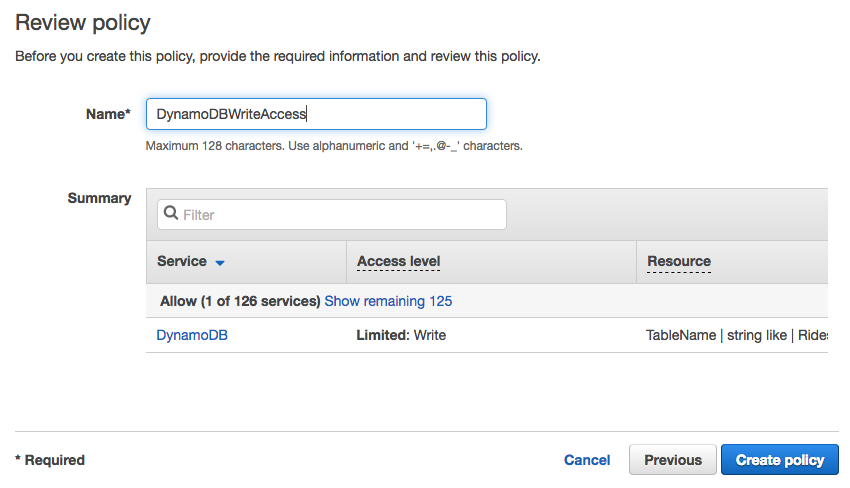
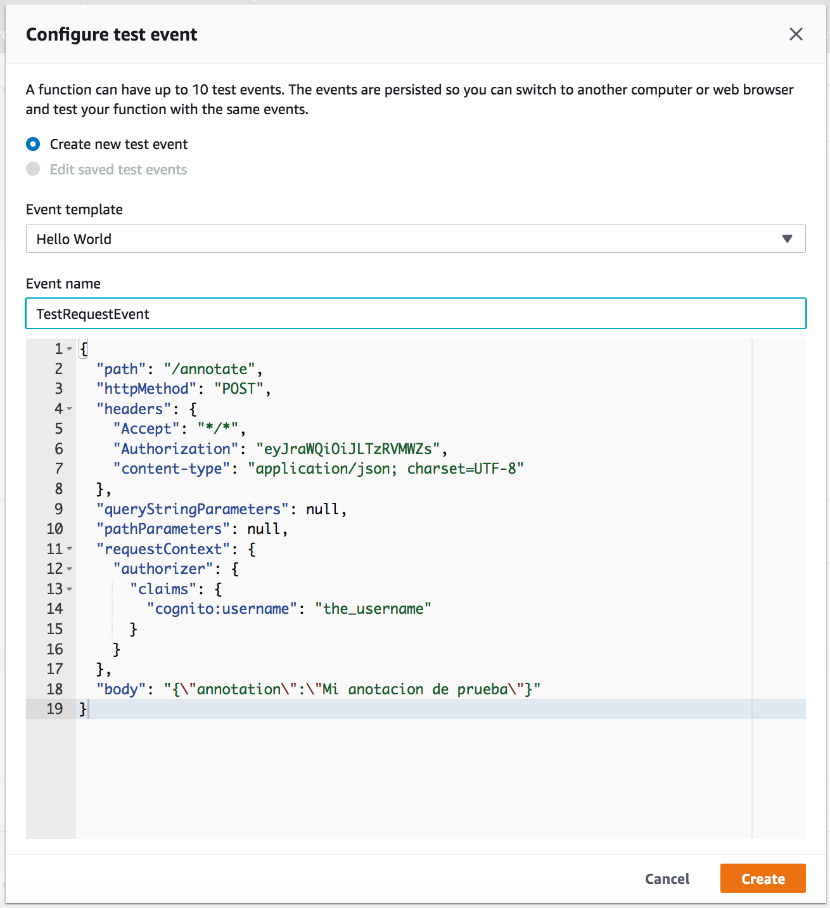

# Módulo 3: Servicio Backend Serverless

En este módulo vas a usar [AWS Lambda][lambda] y [Amazon DynamoDB][dynamodb] para construir el servicio backend que recibirá las peticiones desde tu aplicación web. La aplicación ejecutada en el browser que desplegaste en el primer módulo, permite a los usuarios registrar mensajes y/o notas en una base de datos. De manera de cumplir con ese proposito, el Javascript corriendo en el navegador necesita llamar al servicio corriendo en la nube.  

Implementarás una función lambda que será ejecutada cada vez que un usuario registre una anotación, la función recibirá el texto y lo guardará en la tabla DynamoDB para luego responder a la aplicación cliente en front-end con los detalles de la operación.


La función es invocada desde el navegador usando [Amazon API Gateway][api-gw]. Implementarás esa conexión en el siguiente módulo, para el actual módulo, solo probarás tu función de forma aislada.

## Instrucciones para la implementación

:heavy_exclamation_mark: Asegurate de haber completado los pasos de [User Management][user-management] antes de comenzar con este módulo.

Cada una de las siguientes secciones entrega una descripción general de la implementacion e instrucciones paso a paso. La descripción general deberia proveer suficiente contexto para que puedas completar la implementación si es que ya estas familiarizado con la consola de administración de AWS o si es que quieres explorar en los servicios por tu cuenta sin seguir la guía.

### 1. Crear una tabla Amazon DynamoDB

Use la consola de Amazon DynamoDB para crear una nueva tabla de DynamoDB, a tu tabla ponle el nombre `MyNotesWebApp`, en la llave de partición escribe `userid`, haz click en **Add sort key** y luego escribe `noteid` para el indice de ordenamiento. Toma en cuenta que el nombre de la tabla y los campos son **case sensitive**. Intenta usar exactamente los mismos valores entregados.
Finalmente, desmarca la opcion **Use default settings**, y en las configuraciones que aparecen, haz click en **On-demand**, de esta forma no tendremos que provisionar operaciones de escritura/lectura para esta tabla.

Luego que la tabla está creada, toma nota del ARN para usarlo en el siguiente paso.
After you've created the table, note the ARN for use in the next step.

**:white_check_mark: Instrucciones paso a paso**
1. Navega hasta la [Consola de Amazon DynamoDB][dynamodb-console]
1. Haz click en **Create table**.
1. Escribe `MyNotesWebApp` para el campo **Table name**. Debes usar exactamente el mismo valor entregado debido a que este campo es **case sensitive**.
1. Esribe `userid` en el campo **Partition key** y selecciona **String** para el **key type**. este campo es **case sensitive**.
1. Haz click en **Add sort key** y en el campo que aparece escribe `noteid`. recuerda usar el mismo valor dado que también es **case sensitive**
1. Desmarca la opcion **Use default settings**
1. En la sección de opciones que aparecen, haz click en **On-demand** y luego presiona **Create**.
    
1. En la página de detalles, ve al final y encuentra el **ARN** de tu tabla. Usarás este valor en el siguiente paso.

### 2. Crear un IAM Role para tu función Lambda

#### Background

Cada funcion Lambda tiene asociado consigo un IAM rol. Este rol define a que otros servicios de AWS esta función tendrá acceso. Para los propósitos de este workshop, necesitaras crear un IAM rol que autorice a la funcion Lambda para escribir en Amazon CloudWatch Logs y a escribir registros en la tabla de DynamoDB que acabamos de crear.

#### Instrucciones para la implementación

Use la consola web de IAM para crear un nuevo rol, como nombre escriba `MyNotesWebAppLambda` y luego selecciona **AWS Lambda** para el **role type**. necesitaras adjuntar políticas que entreguen a la función los permisos necesarios para escribir en Amazon CloudWatch Logs y para escribir registros en tu tabla de DynamoDB.

Adjunta la **managed policy** de nombre `AWSLambdaBasicExecutionRole` a este rol para entregar los permisos necesarios para escribir en CloudWatch Logs, También, deberas crear una **custom inline policy** en tu rol, que permita la accion `ddb:PutItem` en la tabla que acabamos de crear en el paso anterior.

**:white_check_mark: Instrucciones paso a paso**
1. Navega hasta la [Consola web de AWS IAM][iam-console]
1. Selecciona **Roles** en la barra de navegación al costado izquiero y luego haz click en **Create role**.
1. Selecciona **Lambda** para el **role type** desde el grupo **AWS service**, luego haz click en **Next: Permissions**
    **Nota:** Seleccionando el **role type** automáticamente genera un **trust policy** que permite a los servicios de AWS asumir este rol por ti. Si crearas este rol usando el CLI, AWS CloudFormation u otro mecanismo, tendrás que especificar esta política diréctamente.
1. Comienza escribiendo `AWSLambdaBasicExecutionRole` en el cuadro de texto **Filter** y selecciona el rol que aparece marcando el cuadro.
1. Haz click en **Next: Tags**. Agrega todos los tags que quieras.
1. Luego haz click en **Next: Review**.
1. Escribe el nombre `MyNotesWebAppLambda` en el campo **Role name**.
1. Finalmente haz click en **Create role**. 

Lo siguiente que debes hacer, es agregar permisos para que el rol pueda acceder a la tabla de DynamoDB

**:white_check_mark: Instrucciones paso a paso*
1. Mientras estás en la consola de IAM, escribe `MyNotesWebAppLambda` en el cuadro de texto para filtrar y selecciona el rol que acabas de crear.
1. En la pestaña de **Permissions**, haz click en el link **Add inline policy** para crear un nuevo **inline policy**.
    
1. Selecciona **Choose a service**.
1. Comienza a escribir `DynamoDB` en el cuadro de busquedas llamado **Find a service** y selecciona **DynamoDB** cuando aparezca.
    
1. Haz click en **Select actions**.
1. Comienza escribiendo `PutItem` en el cuadro de texto llamado **Filter actions** y selecciona el cuadro junto a **PutItem** cuando aparezca.
1. Haz click en la sección **Resources**.
1. Con la opción **Specific** seleccionada, haz click sobre el link, **Add ARN** en la sección **table**.
1. Pega el ARN de la tabla que haz creado en el paso anterior en el campo **Specify ARN for table**, y luego haz click en **Add**.
1. Haz click en **Review Policy**.
1. Escribe `DynamoDBWriteAccess` para el nombre de esta política y luego haz click en **Create policy**.
    

### 3. Create a Lambda Function for Handling Requests

#### Background

AWS Lambda will run your code in response to events such as an HTTP request. In this step you'll build the core function that will process API requests from the web application to dispatch a unicorn. In the next module you'll use Amazon API Gateway to create a RESTful API that will expose an HTTP endpoint that can be invoked from your users' browsers. You'll then connect the Lambda function you create in this step to that API in order to create a fully functional backend for your web application.

#### High-Level Instructions

Use the AWS Lambda console to create a new Lambda function called `RequestUnicorn` that will process the API requests. Use the provided [requestUnicorn.js](requestUnicorn.js) example implementation for your function code. Just copy and paste from that file into the AWS Lambda console's editor.

Make sure to configure your function to use the `WildRydesLambda` IAM role you created in the previous section.

**:white_check_mark: Step-by-step directions**
1. Go to the [AWS Lambda][lambda-console]
1. Click **Create function**.
1. Keep the default **Author from scratch** card selected.
1. Enter `RequestUnicorn` in the **Name** field.
1. Select **Node.js 8.10** for the **Runtime**.
2. Expand *Choose or create an execution role* under **Permissions**.
1. Ensure `Choose an existing role` is selected from the **Role** dropdown.
1. Select `WildRydesLambda` from the **Existing Role** dropdown.
    
1. Click on **Create function**.
1. Scroll down to the **Function code** section and replace the existing code in the **index.js** code editor with the contents of [requestUnicorn.js](requestUnicorn.js).
    
1. Click **"Save"** in the upper right corner of the page.

## Implementation Validation

For this module you will test the function that you built using the AWS Lambda console. In the next module you will add a REST API with API Gateway so you can invoke your function from the browser-based application that you deployed in the first module.

**:white_check_mark: Step-by-step directions**
1. From the main edit screen for your function, select **Configure test events** from the the **Select a test event...** dropdown.
    
1. Keep **Create new test event** selected.
1. Enter `TestRequestEvent` in the **Event name** field
1. Copy and paste the following test event into the editor:
    ```JSON
    {
      "path": "/annotate",
      "httpMethod": "POST",
      "headers": {
        "Accept": "*/*",
        "Authorization": "eyJraWQiOiJLTzRVMWZs",
        "content-type": "application/json; charset=UTF-8"
      },
      "queryStringParameters": null,
      "pathParameters": null,
      "requestContext": {
        "authorizer": {
          "claims": {
            "cognito:username": "the_username"
          }
        }
      },
      "body": "{\"annotation\":\"Mi anotacion de prueba\"}"
    }
    ```
    
1. Click **Create**.
1. On the main function edit screen click **Test** with `TestRequestEvent` selected in the dropdown.   
1. Scroll to the top of the page and expand the **Details** section of the **Execution result** section.
1. Verify that the execution succeeded and that the function result looks like the following:
    ```JSON
    {
      "statusCode": 201,
      "body": "{\"RideId\":\"1h0zDZ-6KLZaEQCPyqTxeQ\",\"Unicorn\":{\"Name\":\"Shadowfax\",\"Color\":\"White\",\"Gender\":\"Male\"},\"UnicornName\":\"Shadowfax\",\"Eta\":\"30 seconds\",\"Rider\":\"the_username\"}",
      "headers": {
        "Access-Control-Allow-Origin": "*"
      }
    }
    ```

### :star: Recap

:key: [AWS Lambda][lambda] is a serverless functions as a service product that removes the burden of managing servers to run your applications. You configure a trigger and set the role that the function can use and then can interface with almost anything you want from databases, to datastores, to other services eithe publicly on the internet or in your own Amazon Virtual Private Cloud (VPC). [Amazon DynamoDB][dynamodb] is a non-relational serverless database that can scale automatically to handle massive amounts of traffic and data without you need manage any servers.

:wrench: In this module you've created a DynamoDB table and then a Lambda function to write data into it. This function will be put behind an Amazon API Gateway in the next module which will in turn be connected to your web application to capture the ride details from your users.

### Next

:white_check_mark: After you have successfully tested your new function using the Lambda console, you can move on to the next module, [RESTful APIs][restful-apis].

[amplify-console]: https://aws.amazon.com/amplify/console/
[cognito]: https://aws.amazon.com/cognito/
[lambda]: https://aws.amazon.com/lambda/
[api-gw]: https://aws.amazon.com/api-gateway/
[dynamodb]: https://aws.amazon.com/dynamodb/
[static-web-hosting]: ../1_StaticWebHosting/
[user-management]: ../2_UserManagement/
[restful-apis]: ../4_RESTfulAPIs/
[dynamodb-console]: https://console.aws.amazon.com/dynamodb/home
[iam-console]: https://console.aws.amazon.com/iam/home
[lambda-console]: https://console.aws.amazon.com/lambda/home