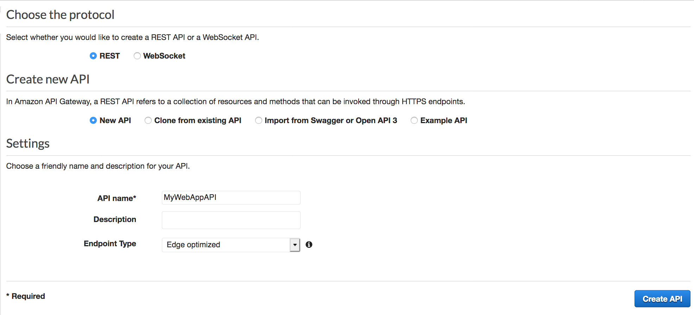
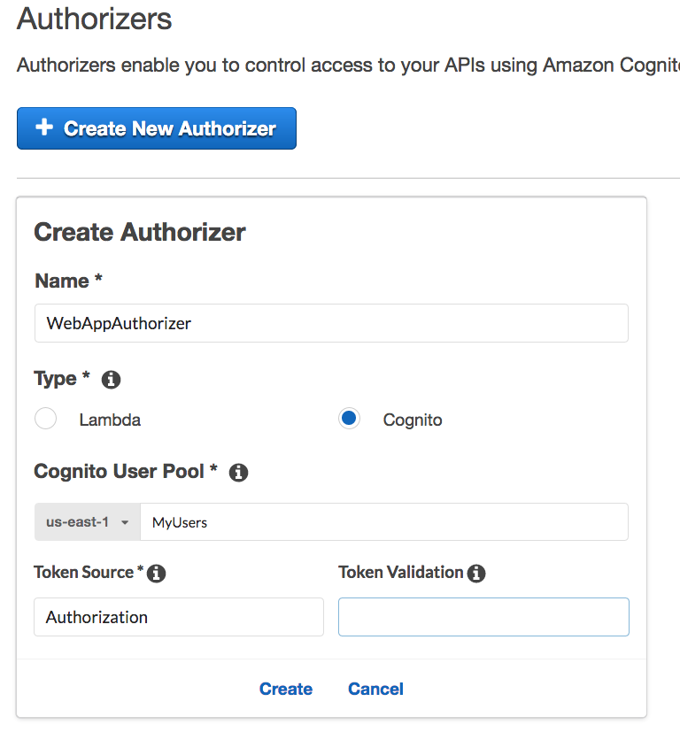
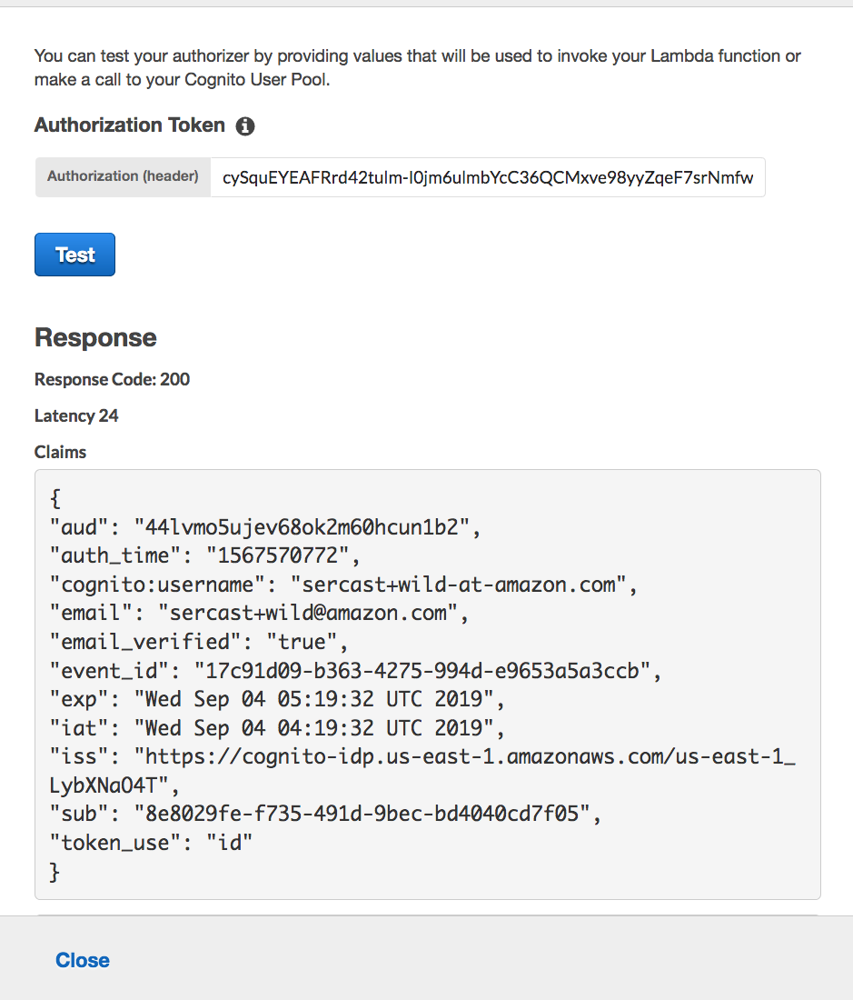
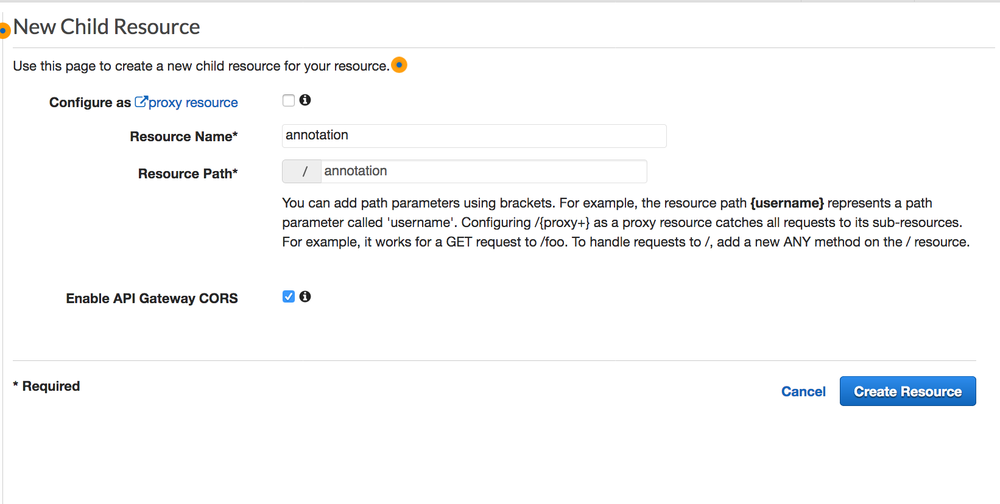
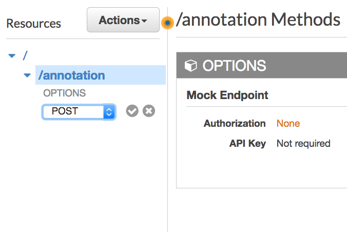
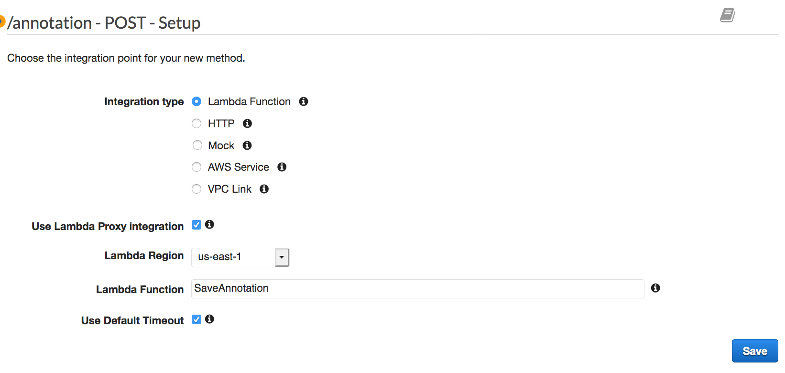

# Module 4: APIs RESTful con AWS Lambda y Amazon API Gateway

En este modulo usarás API Gateway para exponer la función Lambda que creaste en el [módulo anterior][serverless-backend] como una API RESTful, Esta API ser accesible desde internet y será asegurada usando el **Amazon Cognito User Pool** que creaste en el módulo [User Management][user-management]. Usando esta configuración convertirás tu sitio web estático en una aplicación web dinámica añadiendo Javascript en la capa del cliente que realizará llamadas AJAX a nuestra API


El diagrama arriba muestra como el componente API Gateway que construirás en este módulo, se integra con los componentes existentes construidos previamente. Los componentes grises, son aquellos que ya fueron implementados en los pasos anteriores.

El sitio web estático que desplegaste en el primer modulo, ya tiene una página configurada para interactuar con al API que construiras en este módulo, la página /operations.html tiene una interfaz simple que muestra las notas que vamos añadiendo. Luego de autenticarse usando la página /login.html, tus usuarios seran capaces de crear notas escribiendo esta en el cuadro de texto y luego haciendo click en **Guardar** 

Este módulo se enfocará en los pasos requeridos para construir los componentes cloud de una API, si estas interesado en como funciona el código fuente que correo en el navegador, puedes dar una vistazo al archivo [api-gateway-requests.js](../1_StaticWebHosting/website/jsapi-gateway-requests.js) del sitio. En este ejemplo, la aplicación utiliza el método jQuery [ajax()](https://api.jquery.com/jQuery.ajax/) para hacer la petición a la API.

## Instrucciones para la Implementación

:heavy_exclamation_mark: Asegurate de haber completado el módulo [Serverless Backend][serverless-backend] antes de comenzar este workshop.

Cada una de las siguientes secciones entrega una descripción general de la implementacion e instrucciones paso a paso. La descripción general deberia proveer suficiente contexto para que puedas completar la implementación si es que ya estas familiarizado con la consola de administración de AWS o si es que quieres explorar en los servicios por tu cuenta sin seguir la guía.

### 1. Crear una nueva API REST
Usa la consola web de API Gateway para crear una nueva API llamada `MyWebAppAPI`

**:white_check_mark: Instrucciones paso a paso**
1. Navega a la [consola de Amazon API Gateway][api-gw-console]
1. Haz click en **Create API**.
1. Selecciona **REST**, **New API** y escribe `MyWebAppAPI` en el campo **API Name**.
1. Selecciona la opción `Edge optimized` en el menú desplegable **Endpoint Type**.
    ***Note***: Edge optimized son mejores para servicios públicos que son accedidos desde internet. **Regional endpoints** son típicamente usados por APIs que son accedidas principalmente en la misma región. **Private APIs** son para servicios internos en una VPC.
1. Haz click en **Create API**

    

### 2. Crear el Autorizador Cognito user Pools

#### Background
Amazon API Gateway puede usar un token JWT retornado por **Cognito User Pools** para autenticar las llamadas a la API. En este paso, configurarás un autorizador para tu API que utilizará el **user pool** que creaste en el módulo [User Management][user-management].

#### Instrucciones para la Implementación
En la consola web de **API Gateway**, crea un nuevo **Cognito user pool authorizer** para tu API. Configúralo con los detalles del user pool que haz creado en el módulo previo. Puedes probar la configuracion en la consola copiando y pegando el **auth token** impreso en el cuadro de la pagina /login.html de tu sitio luego de la autenticación. 

**:white_check_mark: Instrucciones paso a paso**
1. Bajo la nueva API creada, selecciona **Authorizers**.
    
1. Haz click en **Create New Authorizer**.
1. Escribe `WebAppAuthorizer` for the Authorizer name.
1. Selecciona **Cognito** en la sección **type**.
1. En el menú desplegable bajo **Cognito User Pool**, selecciona la región donde creaste tu Cognito user pool (por defecto, la región actual debe estar seleccionada).
1. Escribe `MyUsers` (o el nombre que le hayas dado a tu user pool) en el cuadro de texto **Cognito User Pool**.
1. Escribe `Authorization` en el campo **Token Source** (Con esto le decimos a API Gateway en que parámetro del header debe buscar el token).
1. Finalmente haz click en **Create**.

    

#### Comprueba la configuración del autorizador

**:white_check_mark: Instrucciones paso a paso**
1. Abre una nueva pestaña del navegador o dirígete a la que tiene abierto tu sitio web y entra en la pagina `/login.html`.
1. Autentícate con las credenciales de tu sitio y en el cuadro de dialogo inferior copia el token `jwt` de la respuesta.
    **Nota:** el token se encuentra entre las comillas en el campo y justo despues de `"jwtToken":`
1. Copia el token y luego vuelve a la pestaña donde acabas de crear el autorizador.
1. Hack click en link **Test** en la parte inferior del cuadro con el detalle del autorizador.
1. Pega el token en el cuadro de texto abajo de **Authorization Token**.
    

1. Haz click en el boton **Test** y verifica que el código de la respuesta es un 200 y que la información de tu usuarios es correcta.

### 3. Crear un nuevo recurso y método
Crea un nuevo recurso con el nombre `/annotate` en tu API, luego crea el metodo POST para ese recurso y configúralo para usar una integración Lambda proxy soportada por la función SaveAnnotation que haz creado en el módulo anterior.

**:white_check_mark: Instruciones paso a paso**
1. En la barra de navegación izquierda haz click en **Resources** bajo tu API `MyWebAppAPI`.
1. desde el menú desplegable **Actions** selecciona **Create Resource**.
1. escribe `annotate` en el campo **Resource Name**.
1. Asegúrate de que el **Resource Path** sea `annotate`.
1. Selecciona la opcion **Enable API Gateway CORS** para este recurso.
1. Haz click en **Create Resource**.

    

1. Con el nuevo recurso creado `/annotate` y seleccionado, desde el menú desplegable **Action** selecciona **Create Method**.
1. Elige `POST` desde el menú desplegable y luego haz click en el **checkmark**.

    
1. Selecciona **Lambda Function** en la sección **integration type**.
1. Marca el cuadro para seleccionar **Use Lambda Proxy integration**.
1. Selecciona la región donde esta la lambda creada **Lambda Region**.
1. Escribe el nombre de la funcion que haz creado en el módulo previo, `SaveAnnotation`, en el campo **Lambda Function**.
1. Haz click en **Save**. Tome en cuenta, si recibes un error diciendo que tu lambda no existe, verifica que la región que seleccionaste coincide con la usada en el módulo previo. 

    

1. Cuando el diálgo de permisos para invocar tu funciona aparezca, haz click en **Ok**.
1. Haz click en el cuadro **Method Request**.
1. Haz click sobre el ícono con el lapiz junto a **Authorization**.
1. Selecciona `WebAppAuthorizer` Cognito user pool authorizer desde el menú desplegable, y luego haz click sobre el ícono **checkmark**.

    

### 4. Despliega tu API
Desde la consola web de API Gateway, haz click en **Actions** > **Deploy API**. en el cuadro de dialogo que aparece para crear un **stage**, puedes usar **prod** para el campo **stage name**  

**:white_check_mark: Step-by-step directions**
1. En el menu desplegable **Actions** selecciona **Deploy API**.
1. Selecciona **[New Stage]** en el menu desplegable **Deployment stage**.
1. Escribe `prod` para el campo **Stage Name**.
1. Haz click en **Deploy**.
1. Toma nota del **Invoke URL**. Lo usarás en la siguiente sección.

### 5. Actualiza el archivo Config del sitio web
Actualiza el archivo /js/config.js de tu sitio web para incluir la URL para este **stage** que acabas de crear. Deberias copiar la URL directamente desde la parte superior de la pagina del editor en la consola web de Amazon API Gateway y pegalo en \_config.api.invokeUrl de su sitio. Cuando lo actualices, asegúrate de mantener los cambios que hiciste en los pasos anteriores para el módulo de Cognito User Pool.

**:white_check_mark: Instrucciones paso a paso**
1. En tu entorno de desarrollo Cloud9 abre el archivo `js/config.js`
1. Actualiza el parámetro **invokeUrl** bajo la estructura de **api** en el archivo config.js. Pon la url que obtuviste en la sección anterior en el campo **Invoke URL**.
    Un emeplo completo del archivo `config.js` se muestr abajo. Nota, los valores en tu archivo pueden diferir de esta muestra.
    ```JavaScript
    window._config = {
        cognito: {
            userPoolId: 'us-west-2_uXboG5pAb', // e.g. us-east-2_uXboG5pAb
            userPoolClientId: '25ddkmj4v6hfsfvruhpfi7n4hv', // e.g. 25ddkmj4v6hfsfvruhpfi7n4hv
            region: 'us-west-2' // e.g. us-east-2
        },
        api: {
            invokeUrl: 'https://rc7nyt4tql.execute-api.us-west-2.amazonaws.com/prod' // e.g. https://rc7nyt4tql.execute-api.us-west-2.amazonaws.com/prod,
        }
    };
    ```

1. Guarda el archivo modificado asegurandote que conserve el mismo nombre `config.js`.
1. Haz el Commit de los cambios a tu repositorio git:
    ```
    $ git add js/config.js 
    $ git commit -m "configure api invokeURL"
    $ git push
    ...
    Counting objects: 4, done.
    Compressing objects: 100% (4/4), done.
    Writing objects: 100% (4/4), 422 bytes | 422.00 KiB/s, done.
    Total 4 (delta 3), reused 0 (delta 0)
    To https://git-codecommit.us-east-1.amazonaws.com/v1/repos/wildrydes-site
       c15d5d5..09f1c9a  master -> master
    ```

    [Amplify Console][amplify-console-console] Amplify debería tomar los cambios y comenzar la construcción y el despliegue de tu aplicación web. Observa su proceso para saber cuando está listo.
    
## Validación de la implementación

**:white_check_mark: Instrucciones paso a paso**
1. Navega a la pagina `/operations.html` en tu sitio web.
1. Si te aparece un mensaje indicando que no estas autenticado, entonces deberás dirigirte a la pagina `/login.html` de tu sitio y proceder con la autenticación.
1. Luego que la pagina es cargada correctamente y que tu usuario aparece en la parte superior del sitio
1. Escribe cualquier texto en el cuadro (No válida si el texto es vacío).
1. Luego haz click en **Guardar**. Deberías poder ver como este texto se agrega en la parte superior.
1. Repite la escritura y el guardado cuantas veces quieras.

### :star: Recap

:key: [Amazon API Gateway][api-gw] Es un servicio administrado que facilita a los desarrolladores crear, publicar, mantener y asegurar las APIs a cualquier escala. Puedes fácilmente agregar autorización via [Amazon Cognito][cognito] y usar servicios como [AWS Lambra][lambda] para crear APIs totalmente serverless.

:wrench: En este módulo utilizaste API Gateway para exponer una función lambda creada en el modulo anterior como una API REST. Luego actualizaste tu sitio para usar este endpoint de manera que tu aplicacion pueda guardar la información que el usuario va registrando en una tabla de DynamoDB.

:star: Felicitaciones, haz completado el Workshop **Serverless Web Application**.


[amplify-console]: https://aws.amazon.com/amplify/console/
[amplify-console-console]: https://console.aws.amazon.com/amplify/home
[api-gw]: https://aws.amazon.com/api-gateway/
[api-gw-console]: https://console.aws.amazon.com/apigateway/home
[cleanup]: ../9_CleanUp/
[cognito-console]: https://console.aws.amazon.com/cognito/home
[cognito]: https://aws.amazon.com/cognito/
[configjs]: ../1_StaticWebHosting/website/js/config.js
[dynamodb-console]: https://console.aws.amazon.com/dynamodb/home
[dynamodb]: https://aws.amazon.com/dynamodb/
[iam-console]: https://console.aws.amazon.com/iam/home
[jwt-decoder]: https://jwt.io/
[lambda-console]: https://console.aws.amazon.com/lambda/home
[lambda]: https://aws.amazon.com/lambda/
[restful-apis]: ../4_RESTfulAPIs/
[serverless-backend]: ../3_ServerlessBackend/
[setup]: ../0_Setup/
[static-web-hosting]: ../1_StaticWebHosting/
[user-management]: ../2_UserManagement/